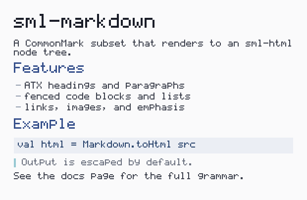

# sml-markdown

[](https://github.com/sjqtentacles/sml-markdown/actions/workflows/ci.yml)

A CommonMark-subset Markdown parser in pure Standard ML. Parses Markdown into
an [`sml-html`](https://github.com/sjqtentacles/sml-html) `Html.node` tree (so
output is escaped safe-by-default), with a convenience that renders straight to
an HTML string. Builds with both **MLton** and **Poly/ML**.



*Generated by [`examples/page.sml`](examples/page.sml) (`make example`):
`Markdown.parse` turns the source into an `Html.node` AST, which is both written
out as real HTML (`Markdown.toHtml` -> `assets/page.html`) and walked to
rasterize this "rendered page" with a small bitmap font.*

## Supported Markdown subset

**Blocks**

- ATX headings (`#` .. `######`)
- Paragraphs (soft-wrapped lines are joined with a space)
- Fenced code blocks (` ``` `), with optional info string -> `class="language-…"`
- Indented code blocks (4 spaces)
- Blockquotes (`>`)
- Unordered lists (`-`, `*`, `+`)
- Ordered lists (`1.`, `2.`, …)
- Nested lists (indent a marker by 2+ spaces)
- Thematic breaks (`---`, `***`, `___`)

**Inline**

- Emphasis: `*x*` / `_x_` -> `<em>`
- Strong: `**x**` / `__x__` -> `<strong>`
- Code spans: `` `x` `` -> `<code>` (contents not parsed for inline)
- Links: `[text](url)` -> `<a href>`
- Images: `` -> ``
- Autolinks: `<http://…>` -> `<a href>`
- Hard line breaks (two trailing spaces) -> `<br>`
- Backslash escapes (`\*`, `` \` ``, …)

All text and attribute values are HTML-escaped automatically by `sml-html`, so
`<`, `>`, `&`, `"`, `'` in source text are emitted as entities.

## Installation

```
smlpkg add github.com/sjqtentacles/sml-markdown
smlpkg sync
```

The vendored dependencies (`sml-html`, `sml-buffer`) are committed under
`lib/github.com/sjqtentacles/`, so the library builds standalone.

## Usage

```sml
(* Render Markdown source straight to an HTML string. *)
val html = Markdown.toHtml "# Hello\n\nA *world* of **Markdown**."
(* => "<h1>Hello</h1><p>A <em>world</em> of <strong>Markdown</strong>.</p>" *)

(* Or get the block-level Html.node tree and compose it yourself. *)
val nodes : Html.node list = Markdown.parse "- one\n- two"
val also  = Html.renderList nodes   (* same as Markdown.toHtml *)
```

The public API (`signature MARKDOWN`):

```sml
val parse  : string -> Html.node list   (* block-level nodes *)
val toHtml : string -> string           (* = Html.renderList o parse *)
```

## Testing

```
make test       # MLton
make test-poly  # Poly/ML
```

Both compilers run the same strict-TDD suite (`test/test.sml`), asserting exact
`toHtml` output for headings, emphasis/strong/code, links, images, autolinks,
fenced and indented code, blockquotes, ordered/unordered/nested lists, thematic
breaks, escaping, hard breaks, and edge cases (empty input, multiple
paragraphs).

## License

MIT
